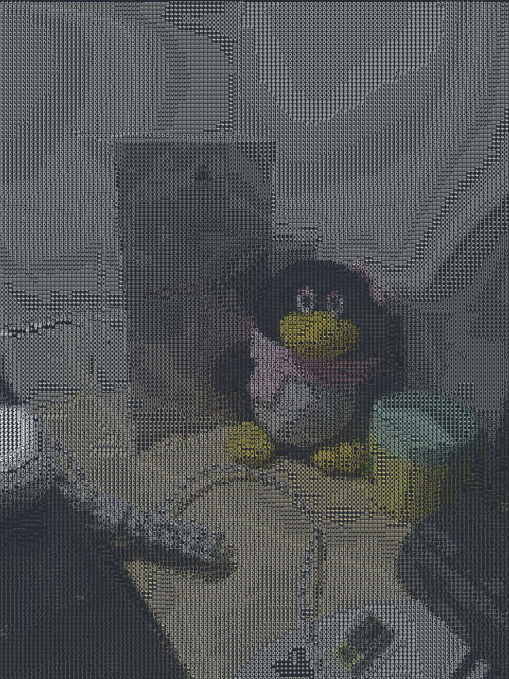

# ASCII Art MCP Server

这是一个给 MCP 生态用的“图片转 ASCII 艺术”云端工具。

- 将本地图片转换为等宽字符的 ASCII 艺术，按 VS Code 深色主题渲染成 PNG。
- 上传到 Supabase 公网存储并返回可分享的 URL，文件名含 UUID 不会覆盖原有文件。
- 只暴露一个统一的 MCP 工具 `generate_ascii_image`，同时支持 Node.js (TypeScript) 与 Python (FastMCP) 运行时。

## 目录结构

```
.
├── ascii-art-python/        # Python 版 (FastMCP)
│   ├── main.py              # 核心 ASCII 生成器
│   └── ascii_art_server.py  # MCP 入口，含 Supabase 上传
├── ascii-art-nodejs/        # Node.js 版 (TypeScript)
│   ├── src/index.ts         # MCP 入口，含 Supabase 上传
│   └── build/index.js       # 构建产物
└── docs/                    # 所有说明文档（已归档到此）
```

## 环境变量（两端一致）

- `SUPABASE_URL`：Supabase 项目 URL
- `SUPABASE_KEY`：Supabase Public Anon Key
- `SUPABASE_BUCKET`：存储桶名称（可选，默认 `ascii-art-images`）

## 快速开始

### Node.js 版

```bash
cd ascii-art-nodejs
npm install
npm run build
# 运行（本地测试）
node build/index.js
```

### Python 版

```bash
cd ascii-art-python
uv pip install -e .
uv run ascii_art_server.py
```

## MCP 工具：generate_ascii_image

必填：

- `image_path`：输入图片的**绝对路径**

可选：

- `width`：字符宽度，默认 100
- `charset`：`simple | detailed | blocks | minimal | matrix`（默认 detailed）
- `color_mode`：`gray | color`（默认 gray）
- `brightness`：0.0–2.0，默认 1.0
- `contrast`：0.0–2.0，默认 1.0
- `invert`：是否反转明暗，默认 false
- `font_size`：仅 Python 版可用，默认 10

返回：

- 上传后的公网 URL（文件名格式：`原名_UUID.png`）

## 示例输出（源图：scan_test.jpg）

源图：


有颜色输出：



无颜色输出：


## 路径安全

- 仅接受**绝对路径**；相对路径会直接报错。

## 配置示例

### 使用 npm 包（Node.js）

```json
{
  "mcpServers": {
    "ascii-art": {
      "command": "npx",
      "args": ["-y", "@frechen026/ascii-art-mcp-server@1.0.1"],
      "env": {
        "SUPABASE_URL": "https://xxx.supabase.co",
        "SUPABASE_KEY": "your-public-anon-key",
        "SUPABASE_BUCKET": "ascii-art-images"
      }
    }
  }
}
```

### 本地 Python 版

```json
{
  "mcpServers": {
    "ascii-art": {
      "command": "uv",
      "args": [
        "--directory",
        "C:\\PATH\\TO\\ascii-art-python",
        "run",
        "ascii_art_server.py"
      ],
      "env": {
        "SUPABASE_URL": "https://xxx.supabase.co",
        "SUPABASE_KEY": "your-public-anon-key",
        "SUPABASE_BUCKET": "ascii-art-images"
      }
    }
  }
}
```

## 版本信息

- Node.js 包：@frechen026/ascii-art-mcp-server（已发布 1.0.1 以修复缺失依赖）
- Python：无需构建，直接 `uv run ascii_art_server.py`

## 许可证

MIT
